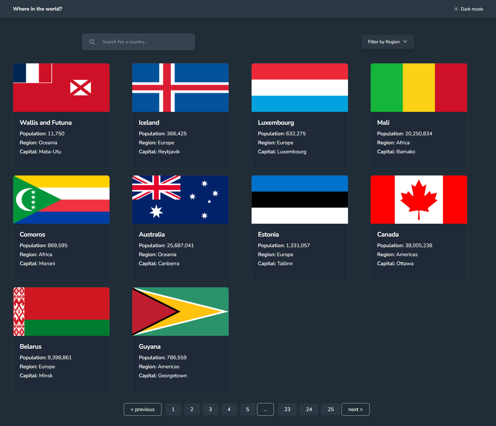
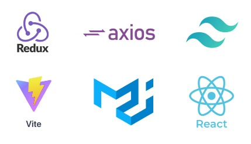

## Country List
our task is integrating with the [REST Countries API](https://restcountries.com/) to pull country data and display it like in the designs.

> **The users should be able to::**
> - See all countries from the API on the homepage
> - Search for a country using an `input` field
> - Filter countries by region
> - Click on a country to see more detailed information on a separate page
> - Click through to the border countries on the detail page
> - View the optimal layout for the interface depending on their device's screen size
> - See hover and focus states for all interactive elements on the page
> - **Bonus**: Toggle the color scheme between light and dark mode

## Deployment

To get started with the Country List, im deploying the application using Vercel [Country List](https://zhafran-countrylist.vercel.app/)

## Stack

Summary of what the stack looks like now including a picture with the core tech:

  

- **Material UI**: A popular React UI framework that implements Google's Material Design. It provides a comprehensive collection of customizable and accessible components, such as buttons, dialogs, and menus, to help you build consistent and visually appealing user interfaces quickly.
- **Axios**: A promise-based HTTP client for the browser and Node.js. It makes it easy to send asynchronous HTTP requests to REST endpoints and perform CRUD operations. Axios supports request and response interception, automatic transformations for JSON data, and more.
- **Flowbite**: A collection of UI components built for Tailwind CSS. It offers a wide range of pre-designed, responsive UI components like buttons, modals, and dropdowns, making it easy to build modern web interfaces.
- **Lodash**: A JavaScript utility library that provides a range of helpful functions for common programming tasks, such as manipulating arrays, objects, and strings. It aims to make code more readable and maintainable by providing reusable, modular functions.
- **PropTypes**: A typechecking library for React props. It ensures that the props passed to a React component conform to the expected types, helping catch bugs and improve code readability. It is especially useful for documenting the intended usage of a component.
- **React**: A popular JavaScript library for building user interfaces, particularly single-page applications. It allows developers to create reusable UI components and manage the state of these components efficiently. React's virtual DOM improves performance by minimizing direct manipulation of the real DOM.
- **React Paginate**: A React component that provides pagination functionality. It allows developers to easily implement pagination in their React applications, offering a variety of customization options for styling and behavior.
- **React Router DOM**: A routing library for React applications. It enables navigation between different views or pages in a React application, allowing for a multi-page experience in a single-page application. It supports nested routes, dynamic routing, and more.
- **Tailwind CSS**: A utility-first CSS framework that provides a set of low-level utility classes to build custom designs directly in the markup. It encourages a highly composable and customizable approach to styling, making it easy to create responsive and modern UIs without writing traditional CSS.
- **Vite**: A build tool and development server designed for modern web projects. It offers fast server start times, hot module replacement, and optimized production builds. Vite supports multiple frameworks, including React, Vue, and Svelte, and leverages native ES modules for a faster development experience.
